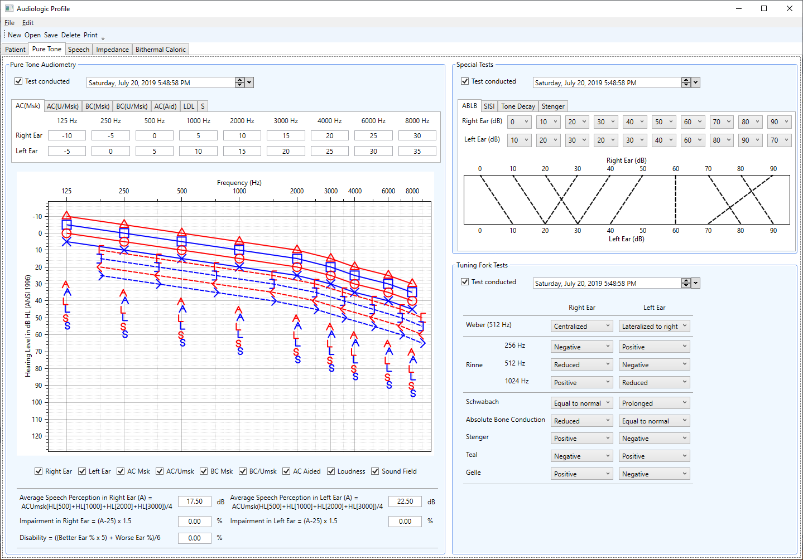
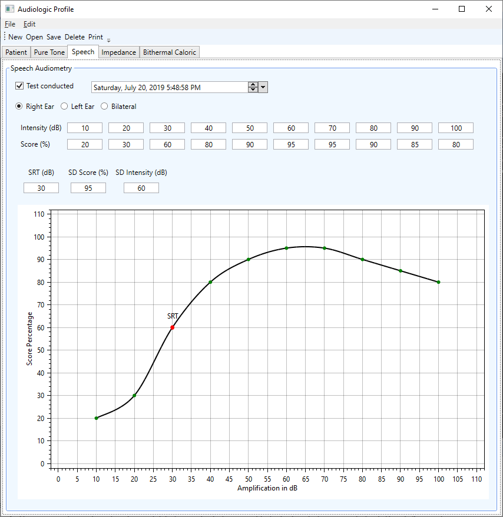
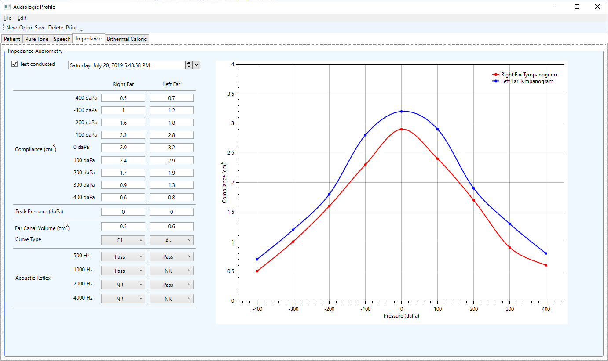
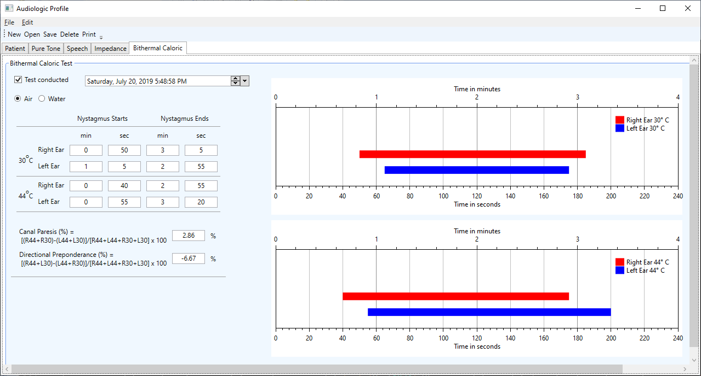
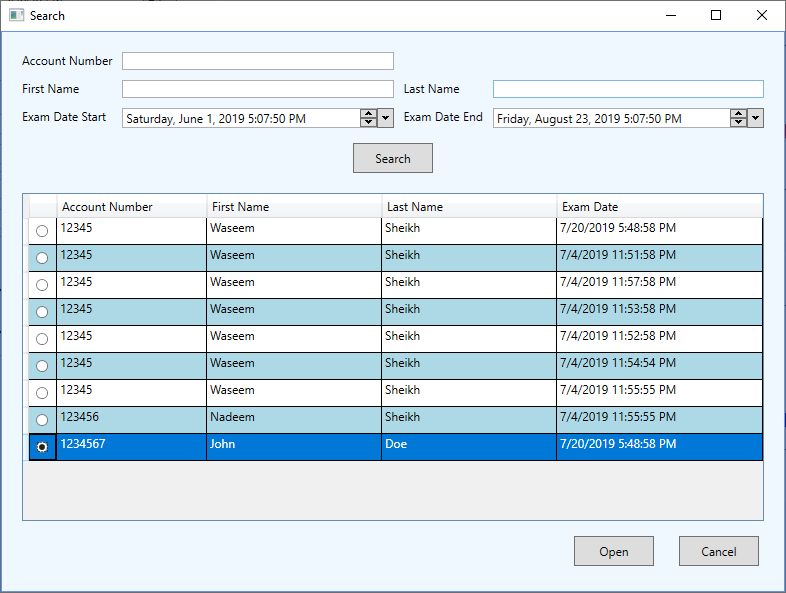
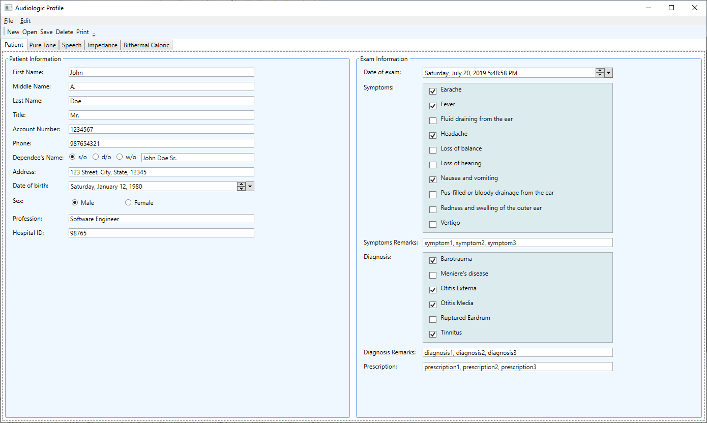

# Summary

Around 466 million people worldwide (over 5% of the world's population) have disabling hearing loss, and out of these 34 million are children [@Who:2019]. Estimates suggest that by 2050, over 900 million people worldwide will have disabling hearing loss. The annual global cost of unaddressed hearing loss amounts to US$ 750 billion [@Who:2019]. Early detection of hearing loss can reduce its impact on an individual's life in addition to saving a huge cost. The existing hearing test applications are closed-source, not extensible, test for a limited number of hearing tests such as pure-tone air conduction audiometry, the audiograms generated are either incomplete or do not fully conform to the American National Standards Institute (ANSI) ANSI S3.6-1996 Specification for Audiometers [@ANSIS3.6-1996:1996], are tightly coupled with a specific vendor hardware, and do not provide an ability to implement various data analytics algorithms to draw important conclusions from the hearing test data [@ChenSmartphone:2018; @SamelliTablet:2018; @BarczikAccuracy:2018; @LivshitzApplication:2017; @AbuSmartphone:2016; @YaoBrowser:2015]. In addition, the price of proprietary hearing test software applications makes these prohibitive for underdeveloped countries which tend to have a higher prevalence of people with hearing loss. In most underdeveloped countries, hearing test data is still stored on paper and graphs such as audiograms are drawn by hand. Such a primitive system of managing hearing test data is error-prone and makes it very difficult to save, track, analyze, and reproduce hearing test data. In addition, a lack of open-source software in this domain stifles innovation.

``Audiometry`` is an open-source application framework written in C# and based on WPF and .NET to create hearing test applications. ``Audiometry`` enables accurate digital recording, search, analysis, graphical visualization, and reproduction of human audio-vestibular impairment test data to assist in hearing loss or disability diagnosis. The framework is built using the Model-View-ViewModel (MVVM) [@MvvmMicrosoft:2019; @MvvmWikipedia:2019] software architectural pattern which separates the development of graphical user interface (GUI) from the development of business and back-end logic. Some of the benefits of the MVVM pattern include reusable components, independent development of GUI and business or back-end logic, flexibility to modify GUI without having to change business or back-end logic, ease of comprehensive unit testing, faster application development time, and reduced maintenance overhead. The proposed framework makes it possible to easily extend the application functionality thus enabling other researchers and practitioners to develop their own hearing impairment diagnosis applications.

``Audiometry`` can store, search, analyze, print, and visualize data corresponding to tuning fork tests including Weber, Rinne, Schwabach, absolute bone conduction, Teal, and Gelle; speech audiometry; pure-tone audiometry (PTA); impedance audiometry; bithermal caloric test; and advanced tests including alternate binaural loudness balance (ABLB), short increment sensitivity index (SISI), tone decay, and Stenger [@KramerAudiology:2019; @GelfandEssentials:2016; @KatzHandbook:2015; @DhingraDiseases:2014; @BessAudiology:2003]. The application framework can also be used to develop new hearing test applications by extending its current functionality. ``Audiometry`` is independent of specific hearing test hardware thus making it possible to be used with a wide variety of hearing test hardware. In addition, ``Audiometry`` provides a unified and uniform interface for storing, analyzing, and visualizing data from a wide range of hearing tests which traditionally rely on different hardware and software. The software was evaluated by an otolaryngologist who found it to be very beneficial in reaching a hearing impairment diagnosis conclusion more methodically, swiftly, and accurately.

The current functionality of the application can be extended and enhanced in various ways. Some important future research directions include adding additional hearing impairment diagnostic intelligence into the application, using machine learning and artificial intelligence techniques to increase the accuracy of diagnosis, and a client-server based architecture of the application.

# Figures

# Documentation
The Doxygen generated API documentation for ``Audiometry`` can be found under the Docs folder.

# Installation

``Audiometry`` can be installed on a Windows 7 or Windows 10 machine. To install the application, run the AudiometryInstaller.msi in the installer directory of the repository. To test the application, please follow the steps delineated in the test.md file under the test folder.

# References
